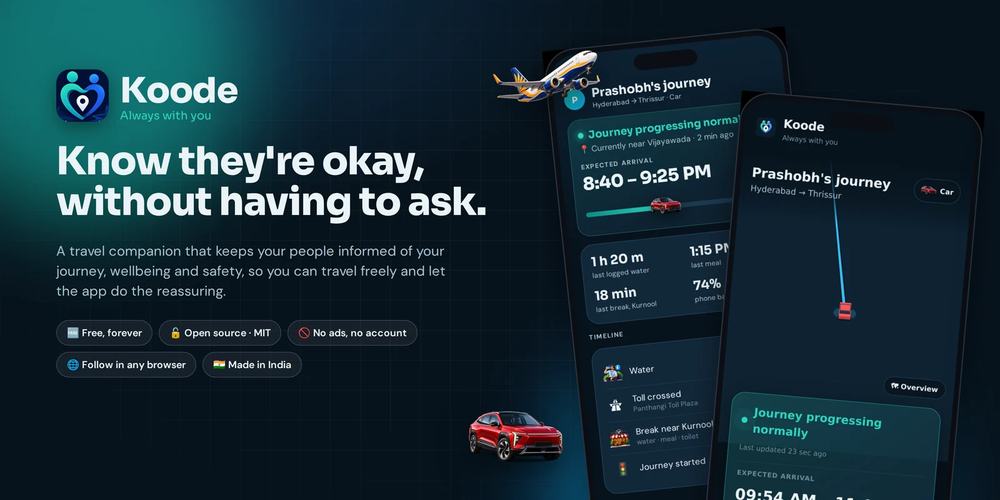
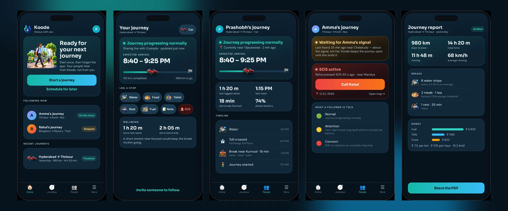
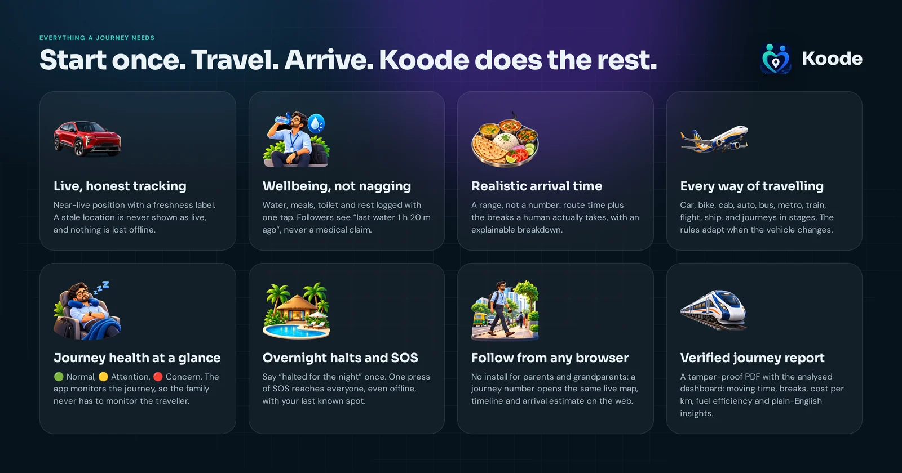
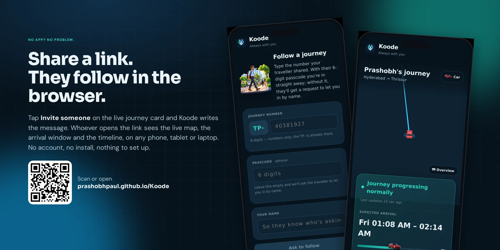

<div align="center">



<br>

# Koode · *Always with you*

**Your journey. Their peace of mind.**

A free, open-source travel companion that keeps the people you love informed of your journey, wellbeing and safety, so you can travel freely and let the app do the reassuring.

[](https://github.com/PrashobhPaul/Koode/actions/workflows/android-build.yml)
[](https://github.com/PrashobhPaul/Koode/actions/workflows/codeql.yml)
[](https://prashobhpaul.github.io/Koode/)
[](https://github.com/PrashobhPaul/Koode/releases/latest)
[](https://github.com/PrashobhPaul/Koode/releases)
[](LICENSE)
[](https://github.com/PrashobhPaul/Koode/stargazers)

<br>

<a href="https://github.com/PrashobhPaul/Koode/releases/latest/download/Koode.apk"></a>
&nbsp;&nbsp;
<a href="https://prashobhpaul.github.io/Koode/"></a>

<sub>Free forever · No ads · No account · No tracking of *you* · Android 8+ · Any browser for followers</sub>

</div>

<br>

> **Koode** (Malayalam: *"together, with you"*) is not a location tracker. The family doesn't monitor the traveller. **The app monitors the journey**, and tells the people who matter the one thing they want to know: *they're okay.*

<br>

## ✨ What people see

<div align="center">

<br><sub>Left to right: Home · your live journey · what a follower sees · journey health and SOS · the verified journey report. App screens are rendered previews of the Koode UI; the browser screens further down are real captures.</sub>
</div>

<br>

**For the traveller** the whole experience is three words: **Start → travel → arrive.** Pick how you're travelling, tap *Start a journey*, put the phone away. Koode runs quietly in the background, logs your breaks with one tap and never asks for a selfie.

**For the people at home** it is a reassurance channel, not a GPS console:

<div align="center">

| | Journey health | What it means |
|:-:|---|---|
| 🟢 | **Normal** | *"Prashobh's journey · Hyderabad → Thrissur · progressing normally · near Vijayawada · arriving 8:40 – 9:25 PM · last water 1 h 20 m ago"* |
| 🟡 | **Attention** | Late-night travel, a long spell without a break, low phone battery, slow updates, off the usual route |
| 🔴 | **Concern** | SOS, no location updates, an unusually long unexplained stop |

</div>

Alerts arrive only when they matter: **journey started**, **needs attention**, **SOS**, **arrived safely**. Everything else is there when they choose to look.

<br>

## 🚀 Everything a journey needs

<div align="center">

</div>

<table>
<tr>
<td width="50%" valign="top">

### 🗺️ Live, honest tracking
Near-live position on a free OpenStreetMap map with a **freshness label**: *live, recent, stale, offline*. A stale location is **never** shown as live. Lose signal in a tunnel and followers see *"waiting for updates"*, never a fake position and never a false *"journey ended"*.

### ⏱️ A realistic arrival time
A **range**, not a number. Route time plus the breaks a human actually takes, with an explainable breakdown. It tightens as the journey unfolds.

### 💧 Wellbeing, not nagging
Water, meals, tea, toilet, rest and fuel logged with one tap each. Followers see **facts** (*"last meal 1:15 PM"*), never a health claim. Gentle, mode-aware nudges when it's been a while.

### 🚨 SOS that works offline
One press reaches everyone in your circle with your last known spot, even with no network: the alert goes out the moment the phone finds a signal.

</td>
<td width="50%" valign="top">

### 🚗 Every way of travelling
Car, bike, cab, auto, bus, metro, train, flight, ship, and **journeys in stages** (auto → flight → metro). Break prompts, deviation checks and sampling cadence all adapt when the vehicle changes.

### 🌙 Overnight halts
Stopping for the night? Say so once. Followers see *"halted for the night"*, morning resume is one tap, and the ETA already knows.

### 📄 A verified journey report
Ending a journey is its one irreversible act, so it gets a review first. Then a **tamper-proof PDF**: moving vs stopped time, average speed, break rhythm, cost per km, fuel efficiency and plain-English insights. The money tracker stays on your phone unless you choose to share it.

### 🔒 Private by design
Journeys are **invitation-only**. The traveller approves each follower **by name**, the shared copy **self-destructs** shortly after the journey ends, and nothing is editable afterwards. The thing people followed stays the thing that happened.

</td>
</tr>
</table>

<br>

## 🌐 No app? No problem.

<div align="center">

</div>

Older parents shouldn't have to install an APK. Tap **Invite someone** on your live journey card and Koode writes the message. Whoever opens the link sees the **same live map, arrival window, wellbeing and timeline** on any phone, tablet or laptop at **[prashobhpaul.github.io/Koode](https://prashobhpaul.github.io/Koode/)**.

- **With the passcode** (it's in the link) they're in instantly.
- **Without it**, they type the journey number and their name, and the traveller gets a request to let them in. Approval is remembered on that browser.
- The page keeps the credential in the part of the URL a browser never sends to any server. Add it to the home screen and it opens like an app.
- The verified journey report opens from the same page once the traveller has approved it.

The only thing a browser can't do is wake a phone with an alert. That one is the app's job.

<br>

## 🧭 How it works

<div align="center">

| 1 · Start | 2 · Share | 3 · Travel | 4 · Arrive |
|:-:|:-:|:-:|:-:|
| Choose how you're travelling and where to. Koode prints an 8-digit **journey number** and a 6-digit **passcode**. | Send the link, or let people **ask by name** and approve them. Add someone mid-journey from the journey card. | Put the phone away. Log breaks with one tap. Koode tracks, estimates, nudges, and tells your circle what matters. | Koode spots the arrival, asks you to confirm, then builds the report. Followers keep access for an hour, then the shared copy is gone. |

</div>

<div align="center"></div>

<br>

## 📲 Get Koode

<table>
<tr>
<td align="center" width="50%">
<br>
<b>Travellers · Android app</b><br>
<a href="https://github.com/PrashobhPaul/Koode/releases/latest/download/Koode.apk">Download Koode.apk</a><br>
<sub>Open the file, allow <i>Install from unknown sources</i> once, done.<br>Updating never affects a journey in progress.</sub>
</td>
<td align="center" width="50%">
<br>
<b>Followers · any browser</b><br>
<a href="https://prashobhpaul.github.io/Koode/">prashobhpaul.github.io/Koode</a><br>
<sub>Journey number + passcode, or ask by name.<br>Nothing to install, nothing to set up.</sub>
</td>
</tr>
</table>

**Following someone with the app:** open Koode → **People** → **Follow a journey** → type the journey number and your name. The `TP-` is printed for you, the passcode is optional. You'll get the forced alerts (start, SOS, arrival) even with the app in the background.

<br>

## 🆕 What's new

| Version | Highlights |
|---|---|
| **6.24.0** | Time on the road is told right. A stretch the phone was silent through but the car moved counts as driving, less any stop logged inside it; a stop with no length ends when the record shows the car leaving, never at the end of the day; a break logged while on a halt belongs to the halt. The hourly chart shows estimated distance for silent hours in a fainter bar, and the journey summary, the reports and the followers' figures all use the same numbers. |
| **6.23.2** | The phone keeps the whole path of a journey, not just its last stretch. Earlier builds trimmed the local record once it was synced, which left reports with a stub of the journey and the distance short. The full record is fetched back from the cloud once per journey, the distance is worked out again from all of it, and for a journey already approved the followers receive the corrected analytics and report. |
| **6.23.1** | Distance driven while the phone was not reporting is no longer lost. When the phone falls silent and comes back further down the road, the stretch in between is credited to the journey — on the phone, in the follower's view and in every report — and a journey that lost such a stretch before this release gets it back on the next open. |
| **6.23.0** | The journey tells its own story. Every report, the app's journey summary and the web viewer now open with a written account that reads differently for every journey: a car or a train, a dawn start or a night drive, a leisurely day or a long pull. Charts join the words: each day as a strip of moving, stopped, halted and out-of-contact time, distance by hour, and for expenses a ring of shares, a category table and spend by day. Followers see the story so far on the web page and in the app, retold every few minutes. Tolls crossed while the phone was out of contact are flagged. |
| **6.22.0** | Reports rebuilt as stories. The journey report opens with what the journey was like, then highlights, the route with every stop pinned by its picture, and each day stop by stop: one stop per place, however many entries it took, with the road between. Every place is named. The expense report shows where the money went and why, per km, fuel bought and efficiency, and every expense with where and when. The emergency last-known-position report leads with the place name and adds coordinates, a map link and the hours before. |
| **6.21.0** | A break or halt you log late sits on the timeline at the time it actually happened, for you and for everyone following. Tap any entry you wrote yourself to correct its time or length, or remove it. Tap the trip spending total for every expense, with correct-amount and remove. |
| **6.20.3** | Fix: a journey whose tracking had been killed (a force stop, an update, a battery manager) now comes back to life the moment you open the app, and the journey screen shows a **Resume tracking** button whenever it is off. The break log keeps **Save** pinned at the bottom, always asks when the break started and how long it was, and lets you pick an exact clock time. **Taking a halt** is a button on the journey screen whenever a journey is open, with "since when" for a halt logged late. |
| **6.20.2** | A break, halt or expense you log is saved on the phone within 10 seconds no matter what else the app is waiting on; it evicts a stuck step rather than queueing behind it. |
| **6.20.1** | Fix: a journey could stop updating for its followers if one network step stalled on a weak signal; every step now has a hard deadline and the journey heals itself. Fix: the break log scrolls, so Save is always reachable after choosing a meal. |
| **6.20** | The car and bus on the map are drawn from real views: top-down and turned to the heading in the overview, from behind when you follow along. Other modes keep their 3D models. The browser overview now lies flat. |
| **6.19** | The vehicle on the map is now the mode's own illustration, upright with a white outline and a soft shadow, facing its way. Restroom and rest join the one-tap log, and food, water, restroom and rest show their pictures on every wellbeing card. |
| **6.18** | Auto-rickshaw joins the travel modes. Every stop, mode and place has its own picture: a restaurant for a food halt, a plate for a meal, water, rest, toilet, fuel, a resort for an overnight stay, a house, an office. MIT licence. |
| **6.17** | Browser viewer rebuilt for people without the app: ask to follow by name, approval remembered, verified report, illustrations, add-to-home-screen. New pictures for water, rest, meals and flights. |
| **6.16** | Illustrations for every travel mode, stop and place across the app. |
| **6.15** | Travel-companion redesign: journey-first Home, More hub, focused settings, one profile avatar everywhere. |
| **6.14** | Premium app shell: brand top bar, adaptive tabs and rail, swipe haptics. |
| **6.13** | Toll crossings detected from location (no SMS permission), server push through Firebase. |

Full history on the [Releases](https://github.com/PrashobhPaul/Koode/releases) page.

<br>

## 👪 Who it's for

- **Anyone who travels** and has someone waiting at home: the weekly intercity commute, the overnight bus, the solo road trip, the first flight alone.
- **Parents and grandparents** who worry, and shouldn't have to call every hour or learn a new app.
- **Friends who split up on a trip** and want to know the other car made it.
- **People who ride at night**: cab, bike or two-wheeler, with an SOS that reaches someone.

Koode is built in India for Indian roads first (₹, kilometres, toll plazas, thalis), and switches to $ / miles or € by region automatically.

<br>

## 🛡️ Data safety

| | |
|---|---|
| **What is shared** | Only what a journey needs: position, status, the breaks you log, phone battery, and your display name. Only with people you approved, only while the journey runs. |
| **What is never shared** | Contacts, messages, call logs, photos, your money tracker, your other journeys. |
| **Where it lives** | On your phone first (the journey is a local event log). A copy for followers lives on a free, open-source Postgres backend behind capability tokens: only your phone can write, followers can only read, and the copy self-destructs after the journey ends. |
| **Accounts and ads** | None. No sign-up, no email, no advertising, no analytics SDKs. |
| **Permissions** | Location (including background, only while a journey runs), notifications, activity recognition, and a foreground service so Android keeps tracking alive. No SMS, no contacts, no camera, no microphone. |

Read the [Privacy policy](docs/PRIVACY.md), the [Terms](docs/TERMS.md) and the [Security policy](SECURITY.md). Koode is **not a medical or safety-guarantee product**: sensor-derived states are inferences, and the app always says which is which.

<br>

## 🧑‍💻 Open source, zero cost, all yours

Koode exists to be useful, not to make money. It is released under the **[MIT licence](LICENSE)**, and the entire stack is free software running on free tiers, so anyone can use, change and run their own:

- **Android app**: Kotlin + Jetpack Compose, local-first event log, foreground-service tracking, adaptive sampling.
- **Maps and routing**: OpenStreetMap data via OpenFreeMap tiles and MapLibre, OSRM routing. No API keys, no Google Maps.
- **Backend**: one SQL file on Supabase (open-source Postgres). Capability-token security, read-only followers, self-destructing journeys. Two small Edge Functions for push and reports.
- **Web viewer**: a single static page, no build step, published on GitHub Pages.
- **CI**: builds and tests every push, CodeQL on every change, one-click APK releases.

<details>
<summary><b>For developers: build, architecture, tests, setup</b></summary>

<br>

Everything engineering lives in **[docs/DEVELOPMENT.md](docs/DEVELOPMENT.md)**: what's in the box, local mode vs cloud mode, the build, configuration, CI, testing and the architecture at a glance. Companion guides:

| Guide | What it covers |
|---|---|
| [ARCHITECTURE.md](docs/ARCHITECTURE.md) | The event log, two-lane sync, state machine, ETA engine, freshness model |
| [SUPABASE_SETUP.md](docs/SUPABASE_SETUP.md) | Enabling cloud sharing on a free Supabase project (one time, ~5 minutes) |
| [PUSH_SETUP.md](docs/PUSH_SETUP.md) | Server push through Firebase |
| [MAPS_SETUP.md](docs/MAPS_SETUP.md) | Why the map needs no setup at all |
| [TESTING.md](docs/TESTING.md) · [DEVICE_TESTING.md](docs/DEVICE_TESTING.md) | Unit tests and the staged real-device plan |
| [RELEASE.md](docs/RELEASE.md) | Cutting a release |
| [docs/spec/](docs/spec) | The full product and engineering specification |

```bash
cd apps/android
./gradlew :app:assembleDebug        # -> app/build/outputs/apk/debug/app-debug.apk
./gradlew :app:testDebugUnitTest    # pure-domain unit tests
```

</details>

<br>

## 💛 Help Koode reach the people who need it

Koode's only goal is to be used. If it gave you or your family one calmer evening:

- ⭐ **Star the repo**: it is the single thing that makes an open-source app discoverable.
- 📣 **Share it**: forward the APK link or the browser link to someone who travels, or who waits.
- 🐛 **Report what's wrong** or **ask for what's missing** in [Issues](https://github.com/PrashobhPaul/Koode/issues).
- 🔧 **Contribute**: pull requests are welcome, from a typo to a new travel mode. Start with [docs/DEVELOPMENT.md](docs/DEVELOPMENT.md).
- 🌍 **Translate**: Koode speaks plain English today. Help it speak Malayalam, Hindi, Tamil, Telugu or Kannada.

<br>

## ❓ Questions people ask

<details><summary><b>Is Koode a family tracker?</b></summary><br>No. Followers never see the traveller's phone, other journeys or anything outside the journey they were invited to, and a journey can only be followed while it runs. Koode tells people the journey is okay; it does not let them watch the traveller.</details>

<details><summary><b>Does it drain the battery?</b></summary><br>Sampling adapts to the mode and the motion: a train at speed is sampled differently from a car in traffic, and a stopped phone is barely sampled at all. Koode runs as a visible foreground service only while a journey is on.</details>

<details><summary><b>What happens when the phone loses signal?</b></summary><br>Nothing is lost. The journey is written to the phone first and synced when a network returns, newest state first, then the backlog. Followers see exactly when the last confirmed update arrived, never a guess.</details>

<details><summary><b>Can a follower end or edit a journey?</b></summary><br>No. A journey is over only when its traveller says so. After that, nothing is editable by anyone.</details>

<details><summary><b>Why an APK instead of the Play Store?</b></summary><br>Koode is free and open source and ships from GitHub Releases so anyone can verify the build they install. A Play Store listing is on the list; the APK will remain available either way.</details>

<details><summary><b>Can I run my own backend?</b></summary><br>Yes. The whole server side is one SQL file plus two small functions on a free Supabase project. <a href="docs/SUPABASE_SETUP.md">docs/SUPABASE_SETUP.md</a> walks through it.</details>

<br>

<div align="center">


**Koode** · *Travel freely. Stay connected. Let the app do the reassuring.*

Made with care in India · [Releases](https://github.com/PrashobhPaul/Koode/releases) · [Browser viewer](https://prashobhpaul.github.io/Koode/) · [Privacy](docs/PRIVACY.md) · [Security](SECURITY.md)

</div>
